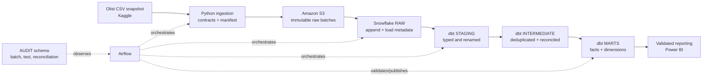

# Orchestrated ELT + Data Quality Pipeline

A portfolio-grade analytics engineering project that turns the Olist Brazilian e-commerce public dataset into a reproducible dimensional warehouse. The target platform is Python → Amazon S3 → Snowflake → dbt Core → Apache Airflow → Power BI, with data contracts, reconciliation, audit logging, and safe replay built into the design.

> **Status:** Milestone 1 is completed and validated. Milestones 2 and 3 are implemented and locally validated, including deterministic S3 ingestion and manifest-driven Snowflake RAW loading. Real AWS/Snowflake execution is pending approved resources and credentials. No dbt, Airflow, Docker, or Power BI integration is claimed yet.

## Business problem

Marketplace reporting can overstate sales when order-item rows are joined directly to payment rows. It can also hide late deliveries, incomplete order lifecycles, and inconsistent reference data. This project designs a trusted reporting layer with explicit grains, independently aggregated monetary measures, and automated quality evidence.

## Architecture



See [architecture](docs/architecture.md) for schemas, replay behavior, and failure boundaries.

## Dataset

[Brazilian E-Commerce Public Dataset by Olist](https://www.kaggle.com/datasets/olistbr/brazilian-ecommerce), version 2, was published by Olist under **CC BY-NC-SA 4.0**. The snapshot contains nine CSV files describing 99,441 orders from 2016-09-04 through 2018-10-17, including customers, items, payments, reviews, products, sellers, geolocation, and category translations. Raw files are intentionally excluded from Git.

Measured profiling highlights:

- 99,441 orders; 112,650 order items; 103,886 payment rows; 99,224 review rows.
- All six declared source foreign-key relationships have zero orphans.
- 261,831 exact duplicate geolocation rows and 42 coordinate rows outside a broad Brazil bounding box.
- 814 repeated `review_id` occurrences beyond the first; `review_id` is not a valid primary key.
- 303 shared orders differ by more than R$0.01 between item-plus-freight and payment totals.
- 7,827 delivered orders arrived after their estimated date.

Full evidence is in [dataset profiling](docs/dataset_profiling.md) and the machine-readable [profile](reports/data_profile.json).

## Engineering features

Completed and locally validated through Milestone 3:

- Dependency-free dataset downloader, profiler, and contract validator.
- SHA-256 checksums, row/column/null/distinct/duplicate/date/range profiling.
- Primary-key and foreign-key validation for all appropriate sources.
- Deterministic historical replay and idempotency design.
- Explicit fact/dimension grains and order-level monetary reconciliation rules.
- Unit tests runnable on the repository's baseline Python 3.9 environment.
- Secret-safe configuration template and raw-data exclusions.
- Deterministic monthly transaction batches and a versioned reference snapshot.
- Canonical manifests with content-derived batch IDs, source/output checksums, byte counts, row counts, and logical timestamps.
- Idempotent local/S3 object uploads, manifest-last commit semantics, integrity checks, conflict detection, exponential retry, structured logs, and server-side encryption requests.
- Version-controlled Snowflake schemas, CSV format, external stage, nine source-shaped RAW tables, audit tables, and validation views.
- Parameterized two-phase COPY loading with rejected-record capture, source/batch lineage, transactional reconciliation, duplicate prevention, and no-op reruns.

Implemented but not yet verified against real cloud services: S3 upload and Snowflake loading through their optional Python connectors. Planned—not yet implemented: dbt models/tests, Airflow DAGs, Docker runtime, operational alerts, and Power BI dashboards.

## Warehouse design

The implemented warehouse SQL separates `OLIST_ANALYTICS` into `RAW`, `STAGING`, `INTERMEDIATE`, `MARTS`, and `AUDIT`. RAW and AUDIT objects are implemented; transformation schemas are currently empty boundaries for Milestone 4. Planned marts include `fct_orders`, `fct_order_items`, `fct_order_payments`, `fct_order_reviews`, `dim_customer`, `dim_order_customer`, `dim_product`, `dim_seller`, `dim_category`, `dim_geography`, and `dim_date`. Every model's grain and key is defined in the [data dictionary](docs/data_dictionary.md).

`item_total = SUM(price) + SUM(freight_value)` and `payment_total = SUM(payment_value)` are computed independently at order grain before joining. Payment value is not labeled accounting revenue; commission, refund, and seller-payout data are absent.

## Local reproduction

Prerequisites: Python 3.9+, `make`, internet access for the public Kaggle download, and about 170 MB of free disk space (126 MB extracted according to Kaggle metadata, plus the archive and profile).

```bash
cp .env.example .env
make download
make test
make profile
make validate
make ingest-local
make warehouse-validate
```

No credentials are required for the public download or local ingestion. Real S3 execution requires an approved existing bucket and credentials from the standard AWS provider chain. Detailed instructions and optional dependency groups are in the [setup guide](docs/setup_guide.md).

## Repository structure

```text
airflow/dags/          # planned orchestration DAGs
data/raw/              # ignored source CSVs
data/processed/        # ignored local derivatives
dbt/                   # planned dbt project
docker/                # planned container definitions
docs/                  # architecture, plans, runbooks, evidence
reports/               # committed aggregate profiling evidence
scripts/               # operator entry points
sql/snowflake/         # versioned warehouse and RAW loading infrastructure
src/olist_pipeline/    # Python contracts, ingestion, warehouse loading, validation
tests/                 # fast unit tests
```

## Documentation

- [Project plan](docs/project_plan.md)
- [Architecture](docs/architecture.md)
- [Data dictionary](docs/data_dictionary.md)
- [Dataset profiling](docs/dataset_profiling.md)
- [Ingestion and S3 runbook](docs/ingestion.md)
- [Snowflake warehouse and loading](docs/snowflake_warehouse.md)
- [Decisions](docs/decisions.md)
- [Setup guide](docs/setup_guide.md)
- [Validation report](docs/validation_report.md)
- [Troubleshooting](docs/troubleshooting.md)
- [Engineering journal](docs/engineering_journal.md)
