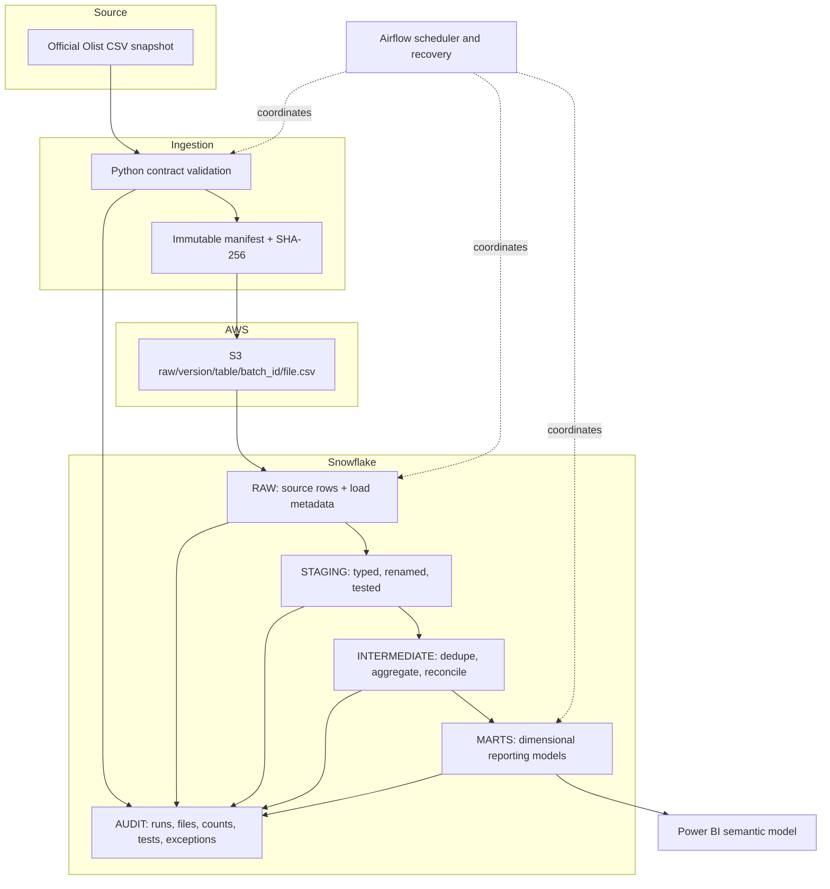
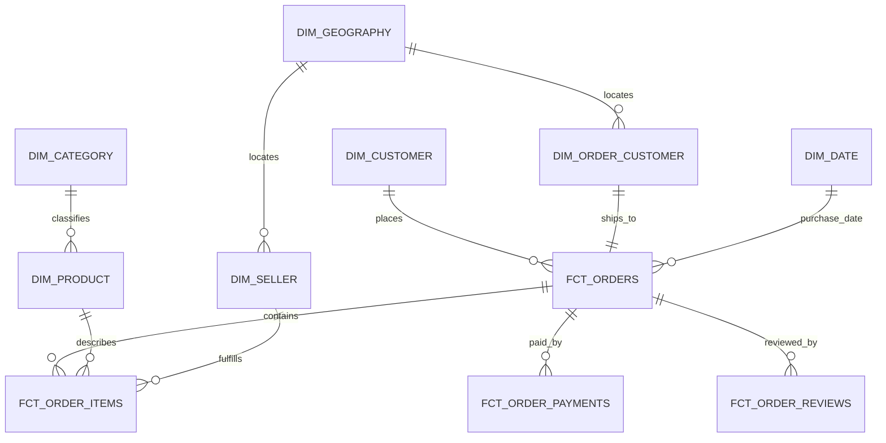

# Architecture

## Target flow



Milestone 1 implements only local acquisition, contracts, profiling, validation, and design. The cloud and analytics components remain unprovisioned.

## Snowflake organization

Planned database: `OLIST_ANALYTICS`.

| Schema | Responsibility | Mutation policy |
|---|---|---|
| `RAW` | Source-shaped tables plus `_batch_id`, `_source_file`, `_file_sha256`, `_loaded_at` | Append immutable batches; no business cleanup |
| `STAGING` | Cast types, normalize names, standardize empty strings, expose source keys | Views or replaceable tables derived only from RAW |
| `INTERMEDIATE` | Deduplicate geolocation, resolve categories, order-grain aggregates and reconciliation | dbt-managed and rebuildable |
| `MARTS` | Facts, dimensions, conformed metrics for reporting | dbt-managed; incremental where justified |
| `AUDIT` | Batch manifests, task/run status, row counts, test outcomes, exceptions, publication state | Append events; controlled status transitions |

Access will use separate least-privilege roles for loading, transformation, orchestration, and read-only BI. Exact grants are deferred until the cloud milestone.

## Batch identity and deterministic replay

The public dataset is a fixed snapshot, not an event feed. Historical simulation therefore uses deterministic logical windows rather than pretending files arrived on dates they did not.

1. Hash each untouched source file with SHA-256 and record its byte size, row count, and source version in a manifest.
2. Define half-open monthly windows `[window_start, window_end)` over `orders.order_purchase_timestamp`.
3. Assign order items, payments, and reviews to the window of their parent order. Load customer, product, seller, category, and geography reference snapshots under the same source version.
4. Derive `batch_id = sha256(source_version | manifest_hash | window_start | window_end | pipeline_contract_version)`.
5. Write immutable S3 keys containing source version, table, window, and batch ID. Never overwrite a different checksum at an existing key.
6. Enforce one successful `AUDIT.FILE_LOAD` record per `(target_table, file_sha256)`. A retry with the same checksum is a no-op; a checksum conflict fails closed.
7. `COPY` into a transient landing table, validate counts/types, then merge or append atomically into RAW. Publish marts only after all tasks and blocking tests pass.
8. dbt incremental models use declared unique keys and the Airflow-supplied batch window. A full refresh must reproduce the same result from the immutable manifest.

This permits chronological demos, reruns, isolated backfills, and failure injection without changing source truth. Late-arriving behavior will be tested synthetically and labeled as such because the snapshot has no ingestion-arrival timestamps.

## Failure and publication boundaries

- Download or checksum failure: no manifest is finalized.
- Partial S3 upload: the batch stays uncommitted and is safe to retry.
- Snowflake validation failure: landing data is discarded; previously loaded RAW data remains.
- dbt/test failure: reporting views are not advanced to the candidate build.
- Power BI reads only the last validated publication identifier.
- Every retry reuses the logical Airflow data interval and batch ID.

## Dimensional model



`DIM_CUSTOMER` represents a person-level `customer_unique_id`; `DIM_ORDER_CUSTOMER` preserves each order-specific `customer_id` and its delivery location. This avoids falsely treating repeat purchases as different people while retaining historical order geography.

## Monetary safety

Items and payments are both one-to-many children of orders. Directly joining them creates a many-to-many fanout. The model will:

```sql
-- conceptual only
item_totals    = group order_items by order_id
payment_totals = group order_payments by order_id
orders         = orders left join item_totals left join payment_totals
```

`item_merchandise_value`, `freight_value`, `item_total_value`, and `payment_total_value` remain separate measures. Differences are surfaced, not forced to zero. “Revenue” is intentionally avoided because the dataset does not expose commission, refunds, taxes, seller payouts, or accounting recognition.

## Resource and cleanup estimate

No cloud resources exist. A later proof-of-concept should fit in a small S3 footprint (well under 1 GB including replay copies) and an auto-suspending Snowflake X-Small warehouse. Cleanup must remove versioned S3 objects, Snowflake database/roles created for the project, local Airflow metadata/containers, and BI credentials only after evidence is retained and explicit approval is obtained.
