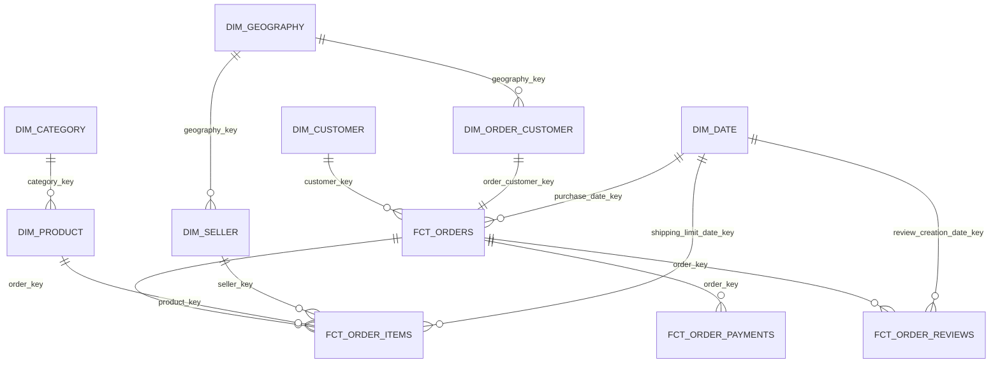
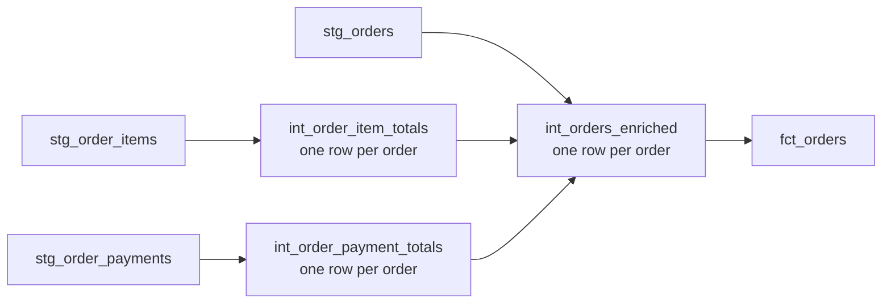

# Dimensional model

## Star schema

## Dimensions

| Model | Grain | Key | Source-derived expected rows |
|---|---|---|---:|
| `dim_customer` | One person-level customer | `customer_key` from `customer_unique_id` | 96,096 |
| `dim_order_customer` | One order-specific delivery customer | `order_customer_key` from `customer_id` | 99,441 |
| `dim_product` | One product | `product_key` from `product_id` | 32,951 |
| `dim_seller` | One seller | `seller_key` from `seller_id` | 3,095 |
| `dim_category` | One product category, including unknown | `category_key` | 74 |
| `dim_geography` | One postal prefix, including unknown | `geography_key` | 19,016 |
| `dim_date` | One date from 2016-09-04 through 2020-04-09 | integer `YYYYMMDD` | 1,314 |

The long date range is intentional: one source shipping-limit timestamp reaches 2020-04-09. Removing that outlier belongs to an explicit quality rule, not an undocumented dimension truncation.

`dim_customer` represents a repeat purchaser. `dim_order_customer` preserves the one-per-order `customer_id` and delivery location. Combining these grains would either duplicate people or discard historical delivery attributes.

Unknown category and geography members prevent nullable/orphaned surrogate keys while preserving the source condition. Untranslated product categories remain separate from null/unknown categories through `translation_status`.

## Facts

| Model | Grain | Unique key | Source-derived expected rows |
|---|---|---|---:|
| `fct_orders` | One order | `order_key` / `order_id` | 99,441 |
| `fct_order_items` | One order line | `order_item_key` / (`order_id`, `order_item_id`) | 112,650 |
| `fct_order_payments` | One payment component | `payment_key` / (`order_id`, `payment_sequential`) | 103,886 |
| `fct_order_reviews` | One distinct normalized review record | `review_key` | 99,224 |

The four expected facts total 415,201 rows. Dimensions total 251,987 rows, for 667,188 expected MARTS rows. These are acceptance expectations derived from source profiling. Actual warehouse counts remain zero until an authorized `dbt build` succeeds.

## Monetary model

Items and payments are separate one-to-many children of an order. A direct join creates `item_count × payment_count` rows and repeats both monetary values. The implemented lineage is:

| Measure | Definition | Additive grain |
|---|---|---|
| `item_merchandise_value` | Sum of item `price` | Order, seller, product, date after appropriate fact aggregation |
| `freight_value` | Sum of item freight | Order and item-compatible dimensions |
| `item_total_value` | Merchandise plus freight | Order |
| `payment_total_value` | Sum of payment components | Order and payment type after appropriate fact aggregation |
| `payment_item_difference` | Payment total minus item total | Order only |
| `is_payment_reconciliation_exception` | Absolute difference above R$0.01 | Order |
| `delivered_gmv` | Merchandise value where order status is delivered | Derived from `fct_orders`; not accounting revenue |

Item and payment totals are tested independently against their detail facts. Their difference is retained because the source contains genuine mismatches; it is never forced to zero.

## Date and delivery logic

`purchase_date_key`, `shipping_limit_date_key`, and `review_creation_date_key` connect to `dim_date`. Lifecycle timestamps remain on `fct_orders` for interval analysis. `delivery_days` measures purchase to customer delivery. `is_late_delivery` is null for undelivered orders and true only when actual customer delivery is after the estimated timestamp.

## Surrogate keys

Surrogate keys are deterministic SHA-256 hashes of normalized, non-null natural-key components separated by a fixed delimiter and explicit null sentinel. They are reproducible across full refreshes and do not depend on load order. Natural keys remain in every fact/dimension for reconciliation and debugging.
